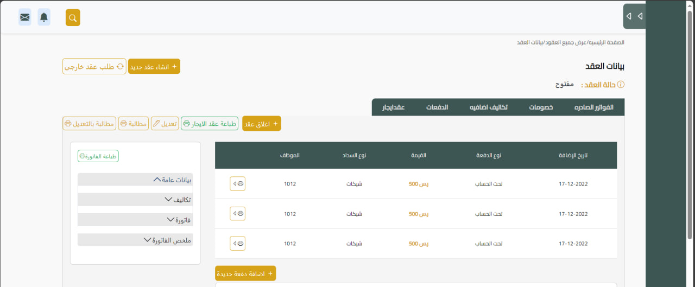
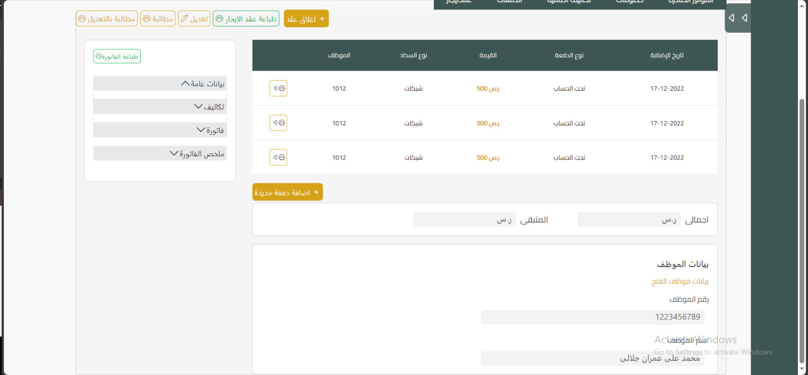

# My Contracts Management Application

This is an Angular-based web application that allows users to manage and track their contracts, such as rent contracts, along with their details. Users can view contract information, update contracts, add fees, provide discounts, and even report clients through the web interface.

## Features

- View and manage contract details including name, amount, and remaining payments.
- Add fees or apply discounts to a contract.
- Update contract information when the client makes a payment.
- user can preview his previous contracts
- Report clients if necessary through the website.

## Technologies Used

- Angular
- Bootstrap
- HTML

## Installation

1. Clone this repository to your local machine:

   ```bash
   git clone https://github.com/your-username/contracts-management.git
2. Install the required dependencies:
   ```bash
   npm install
3. Start the development server:
   ```bash
   ng serve
4. Open your web browser and access the application at http://localhost:4200.:
  
## Screenshots
<div>
  
  
</div>


